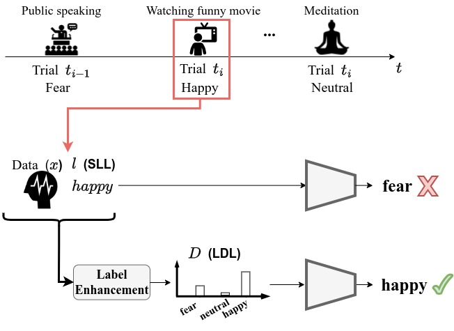

# Towards Addressing Label Ambiguity in Sequential Emotional Responses Through Distribution Learning

[//]: # (<div style="display: flex; justify-content: center;">)

[//]: # (    )

[//]: # (</div>)


This work highlights the challenge of labelling data with single-label categories, as there may be ambiguity in the assigned labels. 
This ambiguity arises when a data sample, which can be influenced by previous affective events is labelled with a single-label category (known as priming).
Label distribution learning (LDL) is proposed as an approach to contend with the ambiguity among labels. 


This repository contains the code to produce the results presented in this work.


## Usage

### Run cross-trial experiment 

The cross-trial experiment is run sequentially for a list of subjects specified in the script `run_cross_trial.py`.
Modify the variables: ``learn_type`` and ``dataset`` to specify the learning type (either single label or label distribution learning) and the dataset (either SEED or SEED5) respectively.

Once these variables are set, just run the following command: 

```python
python run_cross_trial.py
```

### Evaluate cross-trial experiment

To evaluate, i.e. get metrics, of the cross-trial experiment, set again the variables ``learn_type`` and ``dataset`` and run the following command:

```python
python get_results.py
```

Please, if you use the code provided and found relevant the work presented in this paper, cite the following reference in your work: 

```
@INPROCEEDINGS{10970302,
  author={Maestro, Eduardo Gutierrez and Banaee, Hadi and Loutfi, Amy},
  booktitle={2024 12th International Conference on Affective Computing and Intelligent Interaction (ACII)}, 
  title={Towards Addressing Label Ambiguity in Sequential Emotional Responses Through Distribution Learning}, 
  year={2024},
  volume={},
  number={},
  pages={355-361},
  keywords={Training;Affective computing;Computational modeling;Predictive models;Benchmark testing;Data models;Emotional responses;Labeling;Affective computing;label distribution learning;label enhancement},
  doi={10.1109/ACII63134.2024.00045}}
```
